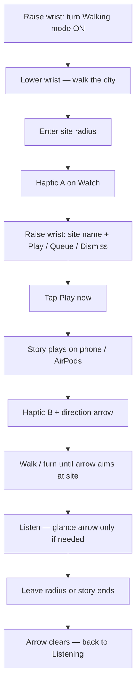
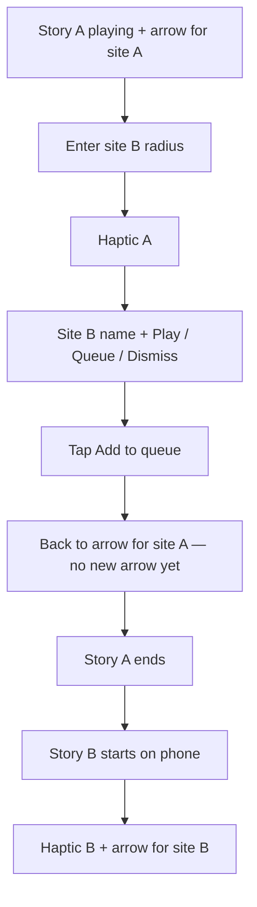

# PRD — Apple Watch Companion

**Product:** Cooltour (app name via `AppConfig.appName` only)  
**Platform:** watchOS companion to the iPhone app  
**Status:** Draft for review  
**Date:** 2026-08-21  
**Relates to:** N5 in [`InitialCooltour.md`](InitialCooltour.md); consent / queue / direction in [`MilaSlices.md`](MilaSlices.md) (Slices 11, 11.5, 12, 13)

---

## 1. Summary

A thin Apple Watch companion that keeps the traveler’s eyes on the city: unique wrist haptics for approach and play-start, consent answers on the wrist, a Now glance with walking-mode control, and a post-play direction arrow toward the site they’re hearing about.

**Audio always plays on the iPhone / AirPods.** The Watch never owns story playback or the proximity brain.

---

## 2. Problem

Solo walkers (validated with Mila) already want screen-free, ask-before-talk behavior. Digging the phone out of a pocket to answer a consent prompt or to figure out *which way the building is* breaks the audio bubble and fails the attention test. The wrist is the right surface for glance + tap; the ears stay on the phone’s audio session.

---

## 3. Goals

| # | Goal | Success looks like |
|---|---|---|
| G1 | **Approach haptic** | Unique Haptic A when a consent prompt opens — distinguishable from system notification buzz and from Haptic B |
| G2 | **Consent on wrist** | Site name + Play now / Add to queue / Dismiss; same outcomes as phone via `promptID` |
| G3 | **Play-start haptic** | Unique Haptic B when phone playback for that site actually starts (including when a queued story begins) |
| G4 | **Wayfinding arrow** | After playback starts, Watch points at the site until the phone clears the target |
| G5 | **Now glance** | Raise wrist → listening / prompting / playing status without opening the phone |
| G6 | **Walking-mode toggle** | Same preference as iPhone; off means no prompts, haptics, or arrow |

### Product principles (inherited)

- **Attention test** — Watch UI is glanceable; no transcript dump, no map chrome.
- **Silence on low confidence** — no guessed bearing; hide the arrow if course/heading aren’t trustworthy.
- **Offline-first** — WatchConnectivity to the paired phone only; no network; no runtime AI.
- **Privacy** — location stays on-device; Watch location only while wayfinding is armed.

---

## 4. Non-goals

- Watch speaker or Watch-side story audio
- Watch-owned `ProximityEngine`, content pack, or SwiftData store
- Direction arrow during the consent prompt (arrow is **post-play only**)
- Map, History, full Settings, complications (unless added in a later PRD)
- AR, accounts, push from a server, PHASE
- Using heading to *gate* triggers (still `AppConfig.headingRefinement` / N2)

---

## 5. Users & jobs

**Primary user:** Solo traveler walking Denpasar (or similar) with phone in pocket and AirPods in, Watch on wrist.

| Job | Watch role |
|---|---|
| “Something’s nearby — do I want it?” | Haptic A + consent taps |
| “Don’t make me pull out my phone” | Now glance + walking toggle |
| “I said yes — where do I look?” | Haptic B + direction arrow |

---

## 6. User flows

Assumed setup: phone in pocket, AirPods in, Watch on wrist, Cooltour installed on both, paired. Screen-free unless the wrist is raised.

### 6.1 Happy path — Play now + follow the arrow



| Step | User does | Watch does | Phone / AirPods do |
|---|---|---|---|
| 1 | Opens Cooltour Watch (or raises glance) | Shows walking mode off | — |
| 2 | Turns **Walking mode** on | Toggle on; status → Listening | Starts proximity / walking session |
| 3 | Walks with eyes up | Idle / listening | GPS listening |
| 4 | Approaches a cultural site | **Haptic A** | Opens consent prompt (TTS/notification as today) |
| 5 | Raises wrist | **Site name** + Play / Queue / Dismiss | Same prompt still active |
| 6 | Taps **Play now** | Leaves consent UI | `accept(promptID:)` → story audio starts |
| 7 | Feels wrist + looks briefly | **Haptic B** + site name + **direction arrow** | Audio playing; sends `wayfindingTarget` |
| 8 | Turns body / walks toward site | Arrow updates from Watch `course` (or heading) | Continues playback |
| 9 | Listens at / near the site | Glance optional; arrow while target armed | Story finishes or user leaves radius |
| 10 | Walks on | Arrow clears; Listening again | Clears wayfinding; re-arms site when past re-arm distance |

### 6.2 Alternate — Add to queue (already listening to something)



| Step | User does | Watch does | Phone does |
|---|---|---|---|
| 1 | Already hearing site A | Arrow for A (if confidence OK) | Playing A |
| 2 | Walks into site B | **Haptic A**; consent for **B** only | Prompts for B (queues if busy per coordinator) |
| 3 | Taps **Add to queue** | Consent closes; **stays on A’s arrow** | Queues B; does **not** send B’s wayfinding yet |
| 4 | Finishes / leaves A’s story | — | Starts B |
| 5 | — | **Haptic B** + arrow for **B** | Sends `wayfindingTarget` for B |

### 6.3 Alternate — Dismiss or timeout

| Step | User does | Watch does | Phone does |
|---|---|---|---|
| 1 | Approaches site | **Haptic A**; site name + 3 actions | Consent prompt + countdown |
| 2a | Taps **Dismiss** | Returns to Listening | `dismiss` → silence |
| 2b | Ignores Watch | Countdown ends → Listening | Timeout → silence |
| 3 | — | No Haptic B, no arrow | No playback |

### 6.4 Walking mode off mid-walk

| Step | User does | Watch does | Phone does |
|---|---|---|---|
| 1 | Raises wrist, turns **Walking mode** off | Status → off; clears prompt/arrow | Stops proximity; cancels open prompt; clears wayfinding |
| 2 | Keeps walking | No further Haptic A/B | No new stories |

### 6.5 First-time wayfinding permission

| Step | User does | Watch does |
|---|---|---|
| 1 | Taps Play now (first time arrow is needed) | May prompt for Watch **location** (wayfinding only) |
| 2 | Allows | Arrow can appear when course/heading are trusted |
| 3 | Denies | Site name + playing state still shown; **no arrow** (silence on low confidence / no permission) |

---

## 7. Architecture

**Pattern:** Phone-orchestrated companion (Approach 1).  
**Link:** WatchConnectivity.  
**Shared values only:** plain `Sendable` structs (`PendingPrompt`, wayfinding target, narration/walking snapshots). No SwiftData on Watch.

```
ProximityEngine → NarrationCoordinator → AudioPlayerService
                         │
                         ├─→ iPhone Now / notifications / AirPods stem
                         └─→ WatchSessionBridge (WatchConnectivity)
                                      │
                                      ▼
                              Cooltour Watch app
                         • Haptic A / Haptic B
                         • Consent (name + 3 actions)
                         • Now glance + walking toggle
                         • Arrow (local course/heading + site coordinate)
```

### 7.1 Phone → Watch

Push on meaningful state change (not a high-rate GPS firehose):

| Payload | When |
|---|---|
| `walkingModeEnabled: Bool` | Toggle changes on either side |
| `narrationState` + optional `PendingPrompt` | Prompt opens / resolves / times out |
| `dismissCountdownSeconds: Int?` | While prompting (optional; Watch may show countdown on Dismiss) |
| `nowPlaying` (site/story display names) | Playback active |
| `wayfindingTarget` | Playback for a site **starts** (Play now, or queued item begins) |
| `wayfindingTarget = nil` | Left radius / stop / walking mode off / target cleared |

**`wayfindingTarget` fields:** `siteSlug`, `siteName`, `latitude`, `longitude`, `triggerRadiusMeters`.

### 7.2 Watch → Phone

| Message | Maps to |
|---|---|
| `accept(promptID:)` | `NarrationCoordinator.accept(promptID:)` |
| `queue(promptID:)` | `NarrationCoordinator.queue(promptID:)` |
| `dismiss(promptID:)` | `NarrationCoordinator.dismiss(promptID:)` |
| `setWalkingMode(Bool)` | Same store as iPhone (`SettingsStore.walkingMode` / `AppConfig.walkingModeKey`) |

Stale `promptID` → no-op (same rule as notification / stem).

### 7.3 Direction arrow (hybrid)

1. Phone arms wayfinding by sending `wayfindingTarget` when playback for that site starts.
2. Watch starts Core Location **only while** target is non-nil.
3. Watch computes bearing from Watch user location → site coordinate.
4. **Orientation source (Slice 12 rules, on the Watch):**
   - Prefer `CLLocation.course` when speed is above a walking threshold **and** course accuracy is valid.
   - Else fall back to Watch heading (`trueHeading` / equivalent) when accurate.
   - Else **hide the arrow** (show site name only) — never invent a direction.
5. Arrow rotation = bearing_to_site − trusted_course_or_heading (normalized degrees).
6. Phone clears target → Watch stops location updates and leaves arrow UI.

**Why hybrid:** Phone keeps session truth; Watch needs low-latency redraw and a wrist-based heading fallback when the walker slows or stops. Streaming continuous angles from the phone is rejected (lag + WC chatter).

---

## 8. UX specification

### 8.1 Now glance

| State | What the wrist shows |
|---|---|
| Walking off | Status: walking mode off + toggle |
| Walking on, idle | “Listening for nearby stories” (or localized equivalent) + toggle |
| Prompting | **Site name** + three actions only (see §8.2) |
| Playing + wayfinding | Site name + direction arrow + optional distance |
| Playing, arrow hidden (low confidence) | Site name + now-playing affordance, no arrow |

Copy for status strings should stay in the same family as `ConsentStrings` / app language override — but the **consent card itself has no prompt sentence**.

### 8.2 Consent (Watch)

**Visible:**

- Site name
- **Play now**
- **Add to queue**
- **Dismiss** (may show countdown seconds if phone sends them)

**Not visible:** spoken prompt line, story title, transcript, direction phrase.

Timeout matches phone (`AppConfig.dismissCountdownSeconds`). No answer → silence; Watch returns to listening.

### 8.3 Haptics

| Event | Haptic | Notes |
|---|---|---|
| Consent prompt appears | **Haptic A** (approach) | Custom pattern; not default notification |
| Playback for site starts (incl. queue → play) | **Haptic B** (play-start) | Clearly different from A |

Haptics are generated on the Watch when the corresponding phone-pushed state arrives. If WC delivers late, haptic follows state (better late than wrong pattern on the phone’s buzz).

### 8.4 Arrow lifecycle

| Start | End |
|---|---|
| Phone reports playback started for site S **and** sends `wayfindingTarget` for S | Phone clears target: left trigger/re-arm geometry, user stopped playback, walking mode off, or story ended without a next wayfinding target |

**Queue:** Queuing alone does **not** show the arrow. Arrow + Haptic B only when that queued story **actually starts** on the phone.

### 8.5 Attention budget

Consent and arrow are meant for a quick raise-and-lower. No scrolling transcripts. Brand string only from `AppConfig.appName` if the name appears at all.

---

## 9. Edge cases

| Case | Behavior |
|---|---|
| WatchConnectivity down | Show stale/unavailable; don’t invent consent outcomes; soft message to use iPhone |
| Double answer (Watch + stem/notification) | First wins; second no-op via `promptID` |
| Second site while playing | Phone queues per Slice 11.5; Watch keeps current wayfinding until current story ends and next starts |
| Walking mode off mid-prompt | Phone cancels; Watch clears prompt, skips further haptics, clears arrow |
| Low GPS accuracy on Watch | Hide arrow; keep site name |
| Standing still (course invalid) | Heading fallback; hide if heading untrusted |
| Phone unlocked / in hand | Same flows; Watch remains valid answer surface |
| Airplane mode | Full loop with paired phone present (no network needed) |

---

## 10. Permissions & privacy

- **Watch location:** requested only for wayfinding; purpose string in the spirit of: point toward the cultural site you’re hearing about.
- No Watch microphone for MVP companion scope.
- No account, no server, no location upload.
- Location samples used for arrow math stay on-device; phone already holds the walk’s proximity logic.

---

## 11. Dependencies on iPhone work

| Dependency | Why |
|---|---|
| `NarrationCoordinator` + `PendingPrompt` | Consent state Watch can render/answer |
| Walking mode in `SettingsStore` | Single preference both UIs toggle |
| Playback start / stop signals | Arm/clear `wayfindingTarget`, fire Haptic B timing |
| Radius leave / re-arm behavior | Clear arrow when user has left the site |
| Slice 12 course-first rules | Same confidence philosophy for Watch arrow math |
| App language / `ConsentStrings` action labels | Consistent Play / Queue / Dismiss wording |

---

## 12. Metrics & acceptance

**Must pass (device):**

1. Walk into a seeded site with phone in pocket → Haptic A + Watch shows site name + three actions.
2. Tap **Play now** on Watch → story plays on phone/AirPods once; Haptic B; arrow points at the real site while walking.
3. Tap **Add to queue** while another story plays → no arrow yet; when queued story starts → Haptic B + arrow for *that* site.
4. Tap **Dismiss** or let countdown finish → silence; no arrow.
5. Walking mode off on Watch → phone stops listening; no further approach haptics.
6. Cover/block GPS or stand still with bad heading → arrow hides rather than spins randomly.
7. Airplane mode + phone present: steps 1–4 still work.

**Unit-testable without hardware:**

- Bearing / arrow-angle pure function (wraparound, course vs heading selection, nil on low confidence).
- WC payload encode/decode and `promptID` staleness.
- Wayfinding arm only on playback start (not on queue-only).

---

## 13. Open decisions (resolved in brainstorm)

| Topic | Decision |
|---|---|
| Where audio plays | Phone / AirPods only |
| When arrow shows | After playback starts, until target cleared |
| Queue + arrow | Only when queued story starts playing |
| Who computes arrow | Hybrid: phone sends site coordinate; Watch computes locally |
| Haptics | A on approach/consent; B on play-start |
| Scope | Thin companion + Now glance + walking-mode toggle |
| Consent UI density | Site name + three actions only (no prompt sentence) |
| Orchestration | Phone-orchestrated via WatchConnectivity |

---

## 14. Out-of-scope follow-ups (not this PRD)

- Watch complications / Smart Stack
- Independent Watch GPS proximity without phone
- Relative-direction *spoken* phrase on Watch (phone TTS remains the voice)
- Rich now-playing controls beyond what’s needed for glance + stop (if ever)

---

## 15. Doc relationships

| Doc | Role |
|---|---|
| This PRD | Watch product requirements |
| [`WatchSlices.md`](WatchSlices.md) | Build plan — Slices 17–21 |
| `InitialCooltour.md` §N5 | Original “Watch next” placeholder (superseded by WatchSlices) |
| `MilaSlices.md` | Consent, queue, course-first direction, notifications |
| `Architecture.md` | Current iPhone service map; Watch bridge not built yet |
| `AGENTS.md` | Shared models/protocols must stay UI-agnostic for Watch |
