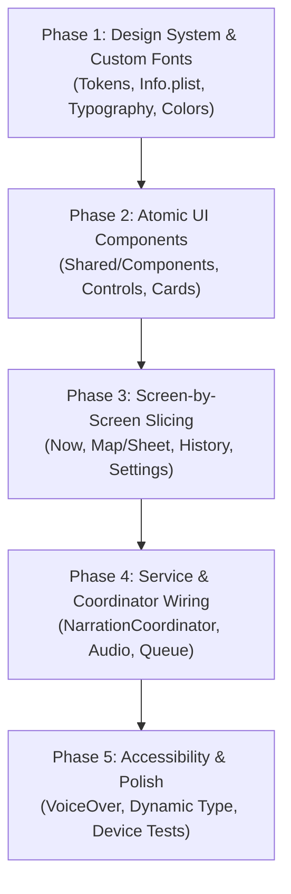

# Figma HiFi Front-End Slicing & Design System Implementation Plan

This plan establishes the architecture and phased roadmap for converting HiFi designs from Figma into production-ready, accessible, and offline-first SwiftUI code for **Cooltour**, adhering strictly to the `AGENTS.md` guidelines (Swift 6 strict concurrency, Observation framework, MVVM feature-foldered architecture, and zero-singleton dependency injection).

---

## 1. What We Need First From You

To kick off **Phase 1 (Design System Foundation & Tokenization)** smoothly:

1. **Custom Font Files & Metadata**:
   - The font file(s) (`.ttf` or `.otf`) created by your friend.
   - The font family name, available weights/styles (e.g., Regular, Bold, SemiBold, Display), and PostScript names.
   - Where the custom font is applied in the design (e.g., Display headers only, body text, cultural site titles, or UI labels).
2. **Figma Access / Selection**:
   - Since the Figma Desktop MCP tool is connected, you can select the **Design System / Token Frame / Style Guide** or individual screens in Figma Desktop, or provide the Figma file / node IDs.
   - Any exported SVG/PDF vector icons or image assets that need to be bundled into `Assets.xcassets`.
3. **Color Palette & Semantic Tokens**:
   - Confirmation on whether the design has dedicated **Dark Mode** and **Light Mode** palettes or a single dark/immersive theme.

---

## 2. Design System Documentation & Architecture

To make sure every developer and AI agent shares the exact same context, the design system will be codified in two synchronized layers:

1. **Markdown Documentation (`docs/DesignSystem.md`)**:
   - Complete visual specification: Typography scales with Dynamic Type mappings, Color tokens with semantic meaning and hex values, Spacing scale (4pt/8pt grid), Radius scale, Shadow/Elevation tiers, Iconography guidelines, and VoiceOver accessibility rules.
2. **Swift Token & Component Code (`Cooltour/Shared/DesignSystem/`)**:
   - `Typography.swift`: Custom font registration, font modifiers, and semantic typography styles.
   - `Colors.swift`: Semantic color tokens (`AppColor`) supporting dynamic Light/Dark mode.
   - `Dimensions.swift`: Spacing (`AppSpacing`), corner radius (`AppRadius`), and touch target minimums (44pt+).
   - `Components/`: Atomic components (`AppButton`, `NowCard`, `ConsentPromptCard`, `SpeedChips`, `QueueItemRow`, `StatusBadge`, `SiteDetailCard`).

---

## 3. Phased Implementation Roadmap

### Phase 1: Design System Extraction, Font Integration & Documentation
- **Custom Font Integration**:
  - Place `.otf` / `.ttf` files in `Cooltour/Resources/Fonts/`.
  - Update `Info.plist` with `UIAppFonts` entries.
  - Implement dynamic font loader / validation in Swift with fallback to system fonts if needed.
- **Design Token Extraction (via Figma MCP & Assets)**:
  - Extract exact colors, typography scale, spacing, radiuses, and shadows.
  - Populate `docs/DesignSystem.md` as the single source of truth for design tokens.
  - Generate Swift tokens: `AppColor`, `AppFont`, `AppSpacing`, `AppRadius`.
- **Assets Catalog Setup**:
  - Add color sets to `Assets.xcassets` with Dark/Light variants.
  - Add custom vector icons / graphics.

### Phase 2: Atomic & Shared Foundation Components
Build reusable, self-contained UI components in `Cooltour/Shared/` with mock-based `#Preview`s:
- **Buttons & Action Controls**: Primary CTA, Secondary action, Dismiss/destructive button, Toggle chip styles.
- **Audio & Playback Controls**: Thumb-sized Play/Pause button, scrubber/progress bar, speed selector dropdown/chips.
- **Card Containers**: Glassmorphic / Elevated card backgrounds, approach prompt banners, queue cards.
- **Status & Feedback Indicators**: Ambient listening status pills, GPS accuracy & permission badges, countdown timers.
- **Sheet & Disclosure Components**: Expandable transcript view, swipeable bottom sheet for site details.

### Phase 3: Screen-by-Screen HiFi Slicing & Migration
Replace old placeholder UI with the HiFi Figma screens one by one:
1. **Screen 1 — Now View (`Features/Now/`)**:
   - Ambient status header ("Listening for nearby stories").
   - Nearest-site teaser with distance & relative direction.
   - Primary Walking Mode toggle + honest permission status note.
   - On-screen Consent Prompt card (Play now, Add to queue, Dismiss with countdown).
   - Now Playing card with large controls, scrubber, speed selector, and collapsible transcript.
   - Up Next / Story Queue list (swipe to dismiss, tap to play).
2. **Screen 2 — Map View & Site Detail Sheet (`Features/Map/`)**:
   - MapKit SwiftUI map with custom site pins, active radius circles, and user location indicator.
   - Modern HiFi `SiteDetailSheet` displaying cultural site info, photo/illustration, and story triggers.
3. **Screen 3 — History & Walk Summary (`Features/History/`)**:
   - Walk timeline feed, visited site cards, trigger outcome indicators (`played`, `queued`, `dismissed`, `timedOut`).
4. **Screen 4 — Settings View (`Features/Settings/`)**:
   - Walking mode settings, permission explanations, audio playback preferences, offline content pack version.
5. **Screen 5 — Notifications & Lock Screen Previews (`Features/Notifications/`)**:
   - Rich approach prompt notification layout design.

### Phase 4: Data Flow & Service Integration
- Wire sliced views to `@Observable` models and services via `AppEnvironment`:
  - `NarrationCoordinator` (state: `.idle`, `.prompting`, `.playing`, `.offeringMore`).
  - `AudioPlayerService` (playback state, progress, duration, rate).
  - `StoryQueueService` (queued stories, deduplication, walk-scoped lifetime).
  - `HistoryStore` (walk history and trigger event recording).
- Ensure strict `@MainActor` isolation and thread-safe UI updates.

### Phase 5: Accessibility, Polish & Verification
- VoiceOver audits: Ensure all custom buttons, scrubbers, and cards have descriptive accessibility labels, traits, and hints.
- Dynamic Type testing: Verify layouts scale gracefully with Large, Extra Large, and Accessibility text sizes.
- Real device & GPX simulation verification.

---

## User Review Required

> [!IMPORTANT]
> **Custom Font Delivery**: Please provide or place the font files in the project or let us know where they are located on your system so we can register them in `Info.plist` and Xcode build phases.

> [!NOTE]
> **Design Slicing Flow**: We will start by generating `docs/DesignSystem.md` and the `Shared/DesignSystem/` Swift code. Once you review and approve the design system tokens, we will slice the screens in sequence (Now -> Map -> History -> Settings).

---

## Proposed File Changes (Phase 1 & Foundation)

### Documentation
#### [NEW] [DesignSystem.md](file:///Users/ketutaguscahyadinanda/Documents/Development/Challenge5/Cooltour/docs/DesignSystem.md)
Detailed specification of colors, custom fonts, typography hierarchy, spacing scale, component specifications, and accessibility requirements.

### Resources & Configuration
#### [MODIFY] [Info.plist](file:///Users/ketutaguscahyadinanda/Documents/Development/Challenge5/Cooltour/Cooltour/Info.plist)
Add `UIAppFonts` key listing custom font filenames.

#### [NEW] `Cooltour/Resources/Fonts/`
Directory containing the custom `.otf` / `.ttf` font files.

#### [MODIFY] [Assets.xcassets](file:///Users/ketutaguscahyadinanda/Documents/Development/Challenge5/Cooltour/Cooltour/Assets.xcassets)
Add color asset definitions and icon assets.

### Shared Design System Code
#### [NEW] `Cooltour/Shared/DesignSystem/Typography.swift`
Custom font loaders, semantic text styles (`.cooltourTitle`, `.cooltourBody`, `.cooltourTeaser`, etc.) with Dynamic Type support.

#### [NEW] `Cooltour/Shared/DesignSystem/Colors.swift`
Semantic color palette tokens (`AppColor.primary`, `AppColor.surface`, `AppColor.accent`, `AppColor.textPrimary`, `AppColor.textSecondary`, etc.).

#### [NEW] `Cooltour/Shared/DesignSystem/Dimensions.swift`
Spacing tokens (`AppSpacing.xs`, `sm`, `md`, `lg`, `xl`), corner radii (`AppRadius.card`, `button`), and layout metrics.

#### [NEW] `Cooltour/Shared/Components/AppButton.swift`
Standardized button styles matching HiFi (primary pill, secondary outline, glassmorphic, destructive).

#### [NEW] `Cooltour/Shared/Components/CardContainer.swift`
Reusable elevated card container styling with optional glassmorphism / borders.

---

## Verification Plan

### Automated & Build Verification
1. Xcode build verification (`xcodebuild build` or project validation) with Swift 6 strict concurrency to ensure zero warnings or errors.
2. Swift Testing unit tests verifying that font names register cleanly and color asset tokens resolve properly.

### Manual & Visual Verification
1. SwiftUI `#Preview` verification for every atomic component and screen with mock environments.
2. Dynamic Type scale testing in Xcode canvas.
3. VoiceOver element inspection.
